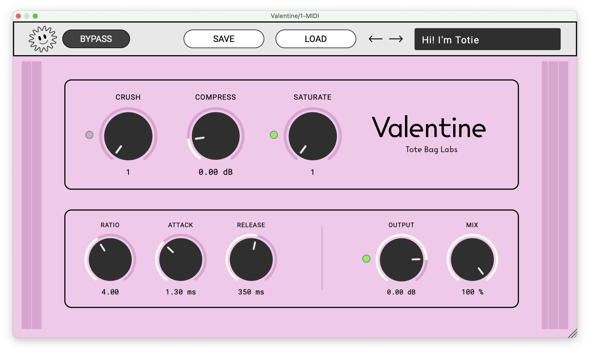

[](https://github.com/Tote-Bag-Labs/valentine/actions/workflows/cmake_ctest.yml)


V A L E N T I N E
==================
Valentine is a compressor and distortion processor. It was inspired by the hyper compressed
and crushed textures in the seminal Justice record, †. Using it is easy: turning input up makes the signal
louder, more compressed, and more saturated. Turning crush up adds digital distortion.

The real fun is in processing signal with some ambience, be it a room or a reverb. With the right input gain
and release settings, you can introduce pumping and breathing artifacts.

I'm writing about the development process [here](https://josediazrohena.github.io/).

Getting Valentine
=================
Download the latest precompiled binaries [here](https://github.com/Tote-Bag-Labs/valentine/releases/latest).

AU and VST3 on MacOs and VST3 on Windows are currently supported.

Using Valentine
===============

Signal Path
----------
Valentine is a non-linear processor. As such, knowing the signal path makes it easier
to get your desired result. Here it is:

**Crush** -> **Compress** -> **Saturate** -> Soft Clip -> **Output** -> **Mix**

Parameters
----------
- **Crush**: increases the amount of bit crushing. Downsamples the signal to 27.5kHz for any setting greater than 0%.
- **Compress**: sets the gain before compresison. Use this to increase the amount of compression and distortion affecting the signal.
- **Ratio**: sets the compression ratio. "Infinity" is more like 1000:1. Increasing this also increases the threshold and decreases the knee.
- **Attack**: sets compression attack time.
- **Release**: sets compression release time.
- **Saturate**: sets the amount of gain applied to signal before Valentine's waveshaper. This gain is compensated to prevent a huge volume boost
when you just want more dirt. Note: at `0%` signal is actually attenuated before the waveshaper, allowing for a cleaner sound when needed.
- **Output**: sets the wet signal's output gain before mix.
- **Mix**:  increases the amount of wet signal in the processor's output.
- **Bypass**: bypasses all processing.

Building Valentine
==================

Xcode
-----

Currently, `Xcode 14.2` is supported for building Valentine.

Here's how to create an Xcode project for building the plugin.

```
git clone https://github.com/Tote-Bag-Labs/valentine.git
cd valentine
git submodule update --init --recursive
cmake -B builds -G Xcode
```

Other (for now)
---------------

If you'd rather just build it from the command line, run
`cmake --build Builds --config Release`


Contributing to Valentine
=========================

If you'd like to get involved, take a look at [issues.](https://github.com/tote-bag-labs/valentine/issues) I could use help on anything marked [bug](https://github.com/tote-bag-labs/valentine/labels/bug) or [enhancement](https://github.com/tote-bag-labs/valentine/labels/enhancement).

I'm currently not taking pull requests for new features.


TODO for Valentine v1.0.0
=========================

- Clean up code

- Write tests

- Finalize parameters and parameter ranges

- Tweak the algorithm

- Write an instruction manual

- Finalize UI
    - Colors
    - Text size/positioning
    - Component size/placement
    - Logos

- Windows installer signing
